# Research-Driven Development

## Overview

Every decision is research-informed. Every phase gates the next. No code without validated specifications.

**Core principle:** Research drives all phases of product development — from technology choices to deployment strategy. The quality of your output is bounded by the quality of your research.

**Iron Law:** NO IMPLEMENTATION WITHOUT RESEARCH-VALIDATED SPECIFICATIONS.

## When to Use

**Always use when:**
- Building a new feature (any size beyond trivial)
- Choosing a technology, library, or pattern
- Setting up project infrastructure (CI/CD, deployment, repo)
- Making architectural decisions
- Starting a new project phase

**Don't use when:**
- Fixing a typo or single-line bug
- Task has explicit, detailed instructions with no ambiguity
- Pure research/exploration (use Explore agent directly)

## The Pipeline

```dot
digraph pipeline {
    rankdir=LR;
    node [shape=box];

    R [label="RESEARCH" style=filled fillcolor="#e3f2fd"];
    V [label="VALIDATE" style=filled fillcolor="#fff3e0"];
    P [label="PLAN" style=filled fillcolor="#e8f5e9"];
    I [label="IMPLEMENT" style=filled fillcolor="#f3e5f5"];
    RV [label="REVIEW" style=filled fillcolor="#fce4ec"];
    VF [label="VERIFY" style=filled fillcolor="#e0f7fa"];
    D [label="DELIVER" style=filled fillcolor="#f1f8e9"];

    R -> V -> P -> I -> RV -> VF -> D;
    RV -> I [label="fix issues" style=dashed];
}
```



Each phase produces an artifact. Each artifact is validated before the next phase begins. Phases cannot be skipped.

---

## Phase 1: RESEARCH

**Goal:** Understand the problem space, current best practices, and existing patterns before any decisions.

**Model:** Haiku or Sonnet (read-only, speed over depth)

**Actions:**
1. **Explore codebase** — Dispatch Explore agent to understand existing patterns, conventions, and architecture
2. **Search documentation** — Use Context7 MCP or web search for current framework/library docs
3. **Research best practices** — Web search for 2-3 independent sources on the specific technology/pattern
4. **Check community patterns** — Search for how others solved similar problems (GitHub, Stack Overflow, official guides)

**Output artifact:** Research summary with:
- Current best practices (with sources)
- Relevant existing patterns in codebase
- Technology-specific considerations
- Security implications (if applicable)

**Quality gate:** Research must include at least 2 independent sources. Single-source research is insufficient.

**REQUIRED SUB-SKILL:** Use superpowers:dispatching-parallel-agents for independent research queries.

---

## Phase 2: VALIDATE

**Goal:** Cross-reference research findings against community consensus and project constraints.

**Model:** Sonnet

**Actions:**
1. **Cross-reference sources** — Do findings agree? Flag contradictions.
2. **Check against project context** — Does the approach fit existing architecture, tech stack, team conventions?
3. **Evaluate trade-offs** — Cost, complexity, maintenance burden, learning curve
4. **Security review** — Flag any security implications from research

**Output artifact:** Validated decision document:
- Recommended approach with justification
- Rejected alternatives with reasons
- Identified risks and mitigations
- Alignment with project conventions

**Quality gate:** Approach must be validated against at least 2 sources AND project context. Contradictions must be resolved, not ignored.

---

## Phase 3: PLAN

**Goal:** Create a detailed, research-informed implementation plan with explicit success criteria per task.

**Model:** Opus (architectural decisions require deep reasoning)

**Actions:**
1. **Write specification** — Define WHAT and WHY, informed by validated research
2. **Decompose into atomic tasks** — Each task modifies 3-5 files max, completable in one agent context
3. **Define success criteria** — Each task has explicit, testable acceptance criteria
4. **Assign model per task** — Use ACR scoring (E+R+I) to select Opus/Sonnet/Haiku per task
5. **Map dependencies** — Identify which tasks can run in parallel vs. sequential

**Output artifact:** Implementation plan saved to `docs/plans/YYYY-MM-DD-<feature>.md`

**Quality gate:** Plan must reference research findings. Each task must have files, code, test commands, and success criteria.

**REQUIRED SUB-SKILL:** Use superpowers:writing-plans for plan format and structure.

---

## Phase 4: IMPLEMENT

**Goal:** Execute the plan task-by-task with fresh sub-agents, following TDD.

**Model:** Per-task ACR routing

| ACR Score | Model | Use Case |
|-----------|-------|----------|
| 3-6 | Haiku | Boilerplate, config, simple CRUD |
| 7-9 | Sonnet | Standard features, tests, UI components |
| 10-15 | Opus | Architecture, security, complex logic |
| Security-critical | Opus | Always, regardless of ACR score |

**Actions:**
1. **Dispatch fresh sub-agent per task** — Complete task context provided upfront (no file reading needed)
2. **Sub-agent follows TDD** — RED (failing test) → GREEN (minimal implementation) → REFACTOR
3. **Sub-agent self-reviews** — Before reporting back, verify own work
4. **Commit per task** — Small, atomic commits with descriptive messages

**Quality gate:** Each task must have passing tests before moving to review.

**REQUIRED SUB-SKILL:** Use superpowers:subagent-driven-development for dispatch and coordination.
**REQUIRED SUB-SKILL:** Sub-agents MUST use superpowers:test-driven-development.

---

## Phase 5: REVIEW

**Goal:** Two-stage review ensures both correctness and quality.

**Model:** Sonnet for spec compliance, Opus for code quality

**Stage 1 — Spec Compliance:**
- Does implementation match specification?
- Are all acceptance criteria addressed?
- Any missing requirements? Any extra/unneeded work?
- Uses: spec-reviewer-prompt.md template

**Stage 2 — Code Quality (only after Stage 1 passes):**
- Clean, maintainable, follows project conventions?
- Security vulnerabilities?
- Performance issues?
- Test quality and coverage?
- Uses: code-quality-reviewer-prompt.md template

**Quality gate:** Both stages must pass. Issues found → implementer fixes → re-review. No skipping re-reviews.

**REQUIRED SUB-SKILL:** Use superpowers:requesting-code-review for review dispatch.

---

## Phase 6: VERIFY

**Goal:** Run all verification commands and confirm against requirements.

**Model:** Sonnet

**Actions:**
1. **Run full test suite** — Not just new tests, ALL tests
2. **Run linter/formatter** — Zero warnings on new code
3. **Run type checker** — If applicable (mypy, dart analyze, tsc)
4. **Requirements checklist** — Line-by-line verification against plan
5. **Regression check** — Ensure no existing functionality broken

**Quality gate:** ALL verification commands must produce passing output in THIS message. No claims without evidence.

**REQUIRED SUB-SKILL:** Use superpowers:verification-before-completion — this is non-negotiable.

---

## Phase 7: DELIVER

**Goal:** Package, document, and ship the work following best practices.

**Model:** Sonnet

**Actions (context-dependent, use what applies):**
- **Git:** Clean commit history, descriptive messages, proper branching
- **CI/CD:** Ensure pipelines pass, add/update workflows if needed
- **Documentation:** Update README, API docs, changelogs as needed
- **Repository setup:** .gitignore, dependabot, branch protection, security settings
- **Deployment:** Infrastructure config, environment variables, monitoring
- **PR/Merge:** Present structured options per superpowers:finishing-a-development-branch

**Quality gate:** All CI checks pass. Documentation reflects current state.

**REQUIRED SUB-SKILL:** Use superpowers:finishing-a-development-branch for merge/PR workflow.

---

## Model Selection Quick Reference

| Task Type | Model | Why |
|-----------|-------|-----|
| Codebase exploration | Haiku | Speed, read-only |
| Documentation lookup | Haiku | Speed, read-only |
| Web research | Sonnet | Reasoning for synthesis |
| Spec writing | Opus | Architectural depth |
| Standard implementation | Sonnet | Best cost-quality balance |
| Boilerplate/config | Haiku | Fast, low complexity |
| Security-critical code | Opus | Always, no exceptions |
| Spec compliance review | Sonnet | Comparison task |
| Code quality review | Opus | Deep reasoning needed |
| Test generation | Sonnet | Standard implementation |
| CI/CD setup | Sonnet | Infrastructure knowledge |

---

## Research Checklist (Per Phase 1)

When researching, always cover these dimensions:

- [ ] **Framework/library best practices** — Official docs, migration guides, known pitfalls
- [ ] **Architecture patterns** — How others structure similar systems
- [ ] **Security considerations** — OWASP top 10, auth patterns, data handling
- [ ] **Performance implications** — Known bottlenecks, optimization patterns
- [ ] **Testing patterns** — How to test this specific technology effectively
- [ ] **Accessibility** — If UI/UX work, accessibility standards
- [ ] **Deployment** — If infra work, deployment best practices

Not all dimensions apply to every task. Use judgment, but err on the side of researching more.

---

## Red Flags — STOP

- About to write code without having researched best practices
- Plan doesn't reference any research findings
- Skipping validation because "I already know the best approach"
- Using single source as basis for decisions
- Proceeding to implementation with unresolved contradictions in research
- Claiming verification without fresh command output
- Skipping spec compliance review and jumping to code quality
- Dismissing reviewer findings without technical justification

**All of these mean:** Go back to the appropriate phase. No shortcuts.

---

## Rationalization Prevention

| Excuse | Reality |
|--------|---------|
| "This is a simple task, no research needed" | Simple tasks with wrong patterns create tech debt. Research takes 2 minutes. |
| "I already know the best practice" | Training data may be outdated. Verify against current docs. |
| "Research slows us down" | Rework from wrong approach is 5-10x slower than research. |
| "One source is enough" | Single-source bias is the #1 cause of incorrect patterns. |
| "The plan is obvious" | Obvious plans miss edge cases. Write it down. |
| "Tests pass, we're done" | Passing tests don't prove correctness. Verify against requirements. |
| "Code review is overkill for this" | Fresh-context review catches what the implementer's context misses. |
| "Delivery setup can wait" | CI/CD and repo hygiene compound. Set up early. |

---

## Integration with Existing Skills

This skill is the **orchestrator** that composes existing skills into a research-driven pipeline:

```
research-driven-development (this skill)
  ├── Phase 1-2: NEW (research + validation — not covered by existing skills)
  ├── Phase 3: superpowers:writing-plans
  ├── Phase 4: superpowers:subagent-driven-development
  │   └── superpowers:test-driven-development (per sub-agent)
  ├── Phase 5: superpowers:requesting-code-review
  ├── Phase 6: superpowers:verification-before-completion
  └── Phase 7: superpowers:finishing-a-development-branch
```

**What this skill ADDS that doesn't exist elsewhere:**
- Mandatory research before any planning or implementation
- Cross-reference validation against multiple sources
- Research-informed specifications (plans reference findings)
- Model routing based on ACR complexity scoring
- Full lifecycle coverage including delivery/infrastructure
- Explicit quality gates between every phase

---

## Adapting to Task Size

Not every task needs all 7 phases at full depth. Scale the pipeline:

| Task Size | Research | Validate | Plan | Implement | Review | Verify | Deliver |
|-----------|----------|----------|------|-----------|--------|--------|---------|
| **XS** (ACR 3-4) | Quick web search | Mental check | Inline notes | Direct | Self-review | Run tests | Commit |
| **S** (ACR 5-6) | 1-2 sources | Brief validation | Short plan | Sub-agent | Spec review | Full suite | Commit + push |
| **M** (ACR 7-9) | 2-3 sources | Written validation | Full plan doc | Sub-agents + TDD | Both stages | Full suite + lint | PR |
| **L** (ACR 10-12) | 3+ sources + docs | Formal document | Detailed plan | Parallel sub-agents | Both stages + final | Full suite + regression | PR + CI |
| **XL** (ACR 13-15) | Comprehensive | Team review | Phased plan | Coordinated teams | Multi-round | Full + performance | PR + deploy |

The phases don't change — only the depth of each phase scales with complexity.

---

## The Bottom Line

**Research is not optional overhead — it is the foundation of quality.**

Every framework in the industry that produces consistently good output (Metaswarm, Spec-Flow, cc-sdd, gbFinch) shares one pattern: structured research and validation BEFORE implementation. The tools that skip research produce inconsistent, often incorrect results.

This skill encodes that pattern as a non-negotiable pipeline.

Run the research. Validate the findings. Plan from evidence. Implement with discipline. Review without bias. Verify with proof. Deliver with confidence.
